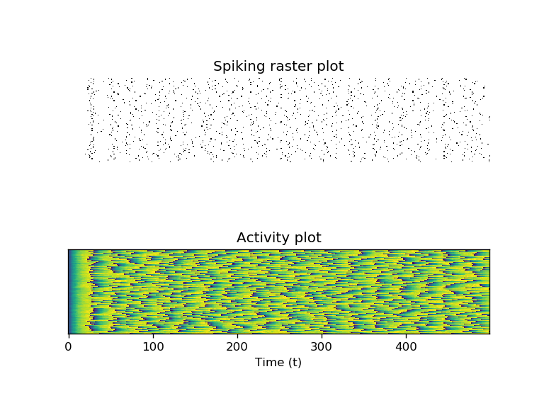
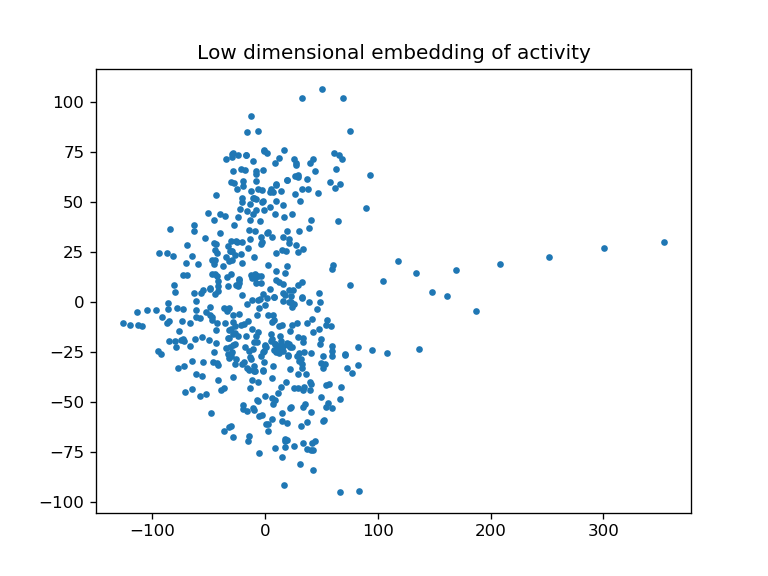
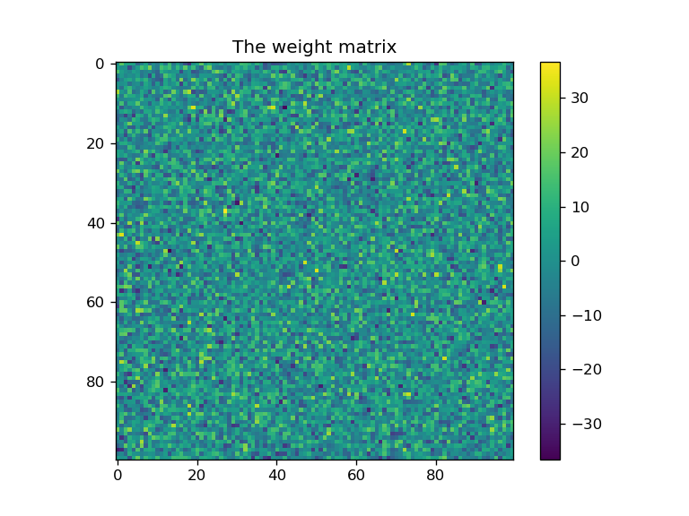
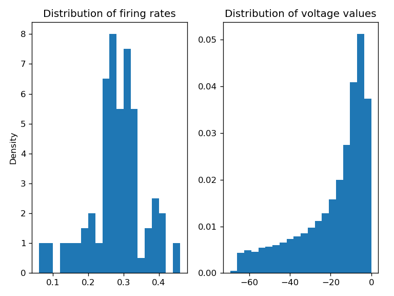

From now on, every Saturday, I will try to upload a neural network model based on some interesting mathematical idea or a particular computation that it can perform. Each section in the articles will start simple, but will biuld up in complexity as the reader goes further. The goal of this project is to both educate people in how our brain carries out computations through neural networks and also to potentially provide researchers with interesting ideas which they can develop further or use for inspiration.


All articles will be structured in the following way:

A short introduction to the mathematical background or the computation which will be used in constructing the network.
description of the model with a focus on the weight matrix and the inputs coming to a network.
A visual representation of network activity, the weight matrix, distributions of different relevant statistics.
A final discussion of the properties and potential computation that the network might perform.


As this is the introduction to the project I will discuss some of the prerequisites for understanding the articles. This discussion is probably not going to be interesting to researchers as it lays out some fundamental concepts which they are probably already familiar with.


**What is a Neural Network?**

Sometimes neural networks are separated into artificial and biological networks, this distinction refers to the neural networks found in the fields of machine learning and computational neuroscience respectively. In reality there is a continuum of neural network models with a varying degree of biological realism. As one would expect in machine learning there is no impetus to consider biological realism as the goal is to get the network to perform a particular task and adding the messiness of biology will only make things needlessly complicated. On the other hand computational neuroscience does (for the most part) care about biological realism, so the models used there try to reproduce at least some biological details. 
An insightful difference between the two is that artificial neural networks (ANNs) tend to be written as statistical models which develop in discrete time while biological neural networks (BNNs) tend to be written as differential equations which develop in continuous time. This is because, as a result of the electrochemical mechanisms underlying the activity of the neural networks in our brains, the recordings that neuroscientists are interested in are continuous.
In these articles the focus will most of the time be on BNNs but it is not infeasable that ANNs pop up as well. As the word network implies, neurons are connected to each other with different weights and it is these weights that determine what type of dynamics a network will have. To hammer on the richness of potential different neural networks we can build, note that for N neurons each neuron can connect to N neurons (we allow the possibility of self-connections) so there will be $N^2$ connections that have to be specified. If we allow the connections to be either 1 or -1 (*they can continuously vary which implies that there are is an uncountably infinite set of potential networks for any N, but it is not obvious when changes in the weight actually contribute to a qualitative change in the dynamics*), then there are $2^{N^2}$ networks that can be made. For example if we take 10 neurons we can build $2^{100}$ networks, the neurons in the human brain are estimated to be around 86 billion.
Furthermore neurons can receive input from outside the network, what "outside" means is a bit confusing as in the periphery it could mean truly external inputs like light or sound, but it could also mean input coming from another network which we are not considering.
More abstractly, we will call a neural network something which has the following equation:
<a href="https://www.codecogs.com/eqnedit.php?latex=\dot{x_i}=f(x,t,W,I)" target="_blank"></a>
On the left-hand side, the dot over x refers to the time derivative, $x_i$ can be any variable which describes the neural activity (this can be anything from voltage, current, firing rate, a binary spike or even the probability of spiking) of neuron number i. On the right hand side x is the activity of all neurons (also known as the network state), t is time, W is the weight matrix which describes how neurons are connected and I are the inputs coming into the network from the outside.
For the following examples we will use the simplest model called the Integrate and Fire (IF) model, it has the following equations:
$$\dot{x}_i = -(x-x_{rest})+\sum_j{W_{ij}\cdot s_j(t)} + I_i(t)$$
$x_{rest}$ (=-60) is the resting potential which cells tend to go back to after receiving an input and $s_j(t)$ is a binary vector encoding whether neuron j spikes at time t, this is important because in the model two neurons can only interact if one of them spikes. In addition there are two other paramters the spiking threshold (=0) and the reset potential (=-70). Whenever the activity of the neuron passes the threshold, we say that it has spiked and reset the potential to the second value - the reset potential.

Other central ideas in understanding neural networks like computation, representation and coding, will be explored further in the presentations of particular models.


**How to read the plots?**

Here we will make clear how to read some of the plots that are usually used to analyze neural activity, this is not an exhaustive list but should be enough for now. All figures were generated by using a simple Integrate and Fire neural network model.

**Activity plots**

The standard visual representation of neural activity is the raster plot, in which each row contains the activity of one neuron in the network. Spikes are represented as black dots. Usually these plots show the discrete spikes generated by a network, but we might also use a similar presentation to visualize continuous activity as shown in the bottom plot (run the bottom three panels of code to see the plots):


```python
'''Article 1: Introduction to Neural Nets'''
import numpy as np
import matplotlib.pyplot as plt
from sklearn.decomposition import PCA


#Start by defining the network model
#We will use a simple integrate and fire model
#Don't worry too much about the specifics of the model
def IF_model(W,T,I,thresh=0,eq=-60,reset=-70,mu=0.1,epsp=1):
    X = np.zeros([len(W),T])
    X[:,0] = eq
    spikes = np.zeros([len(W),T])
    for t in range(T-1):
        dx = eq-X[:,t]+np.dot(W,epsp*spikes[:,t])+I[:,t]
        X[:,t+1] = X[:,t]+mu*dx
        spikes[np.where(X[:,t+1]>thresh),t+1] = 1
        X[np.where(X[:,t+1]>thresh),t+1] = reset
    return [spikes,X]

#define the paramters of the network
N = 100 #number of neurons
T = 500 #number of time points

#use constant input with some variance
Inputs = 60+10*np.random.randn(N,T)

#sample the weights from a normal distribution with 0 mean and variance 10
#and make the matrix diagonal 0
Weights = 10*(np.random.randn(N,N))
np.fill_diagonal(Weights,0)

#Run the model and store both spikes and activity values
x = IF_model(Weights,T,Inputs)

#calculate some statistics eg. firing rate
fr = 10*np.sum(x[0],1)/T #multipy by 1 over the integration constant mu=0.1

#perform dimensionality reduction with PCA to show low dimensional embeding of activity
pca = PCA(n_components=2)
x_reduced = pca.fit_transform(x[1].T)

```


```python
#Activity plot
plt.figure(dpi=150)
plt.subplot(2,1,1)
plt.imshow(-x[0],'gray') #raster plot of the spikes
plt.title('Spiking raster plot')
plt.axis('off')
plt.subplot(2,1,2)
plt.imshow(x[1])
plt.title('Activity plot')
plt.xlabel('Time (t)')
plt.yticks([])
```



There are other creative ways to represent neural activity, for example using dimensionality reduction one can represent neural activity as a manifold in 2 or 3 dimensions. In this example activity was reduced by applying Principal Components Analysis (PCA). While this plot may not seem very informative, dimensionality reduction techniques are widely used to find interesting structure in neural activity.


```python
#dimensionality reduced activity
plt.figure(dpi=150)
plt.plot(x_reduced[:,0],x_reduced[:,1],'.')
plt.title('Low dimensional embedding of activity')
```



**Weight matrix**

We will represent the weight matrix by a colored 2 dimensional array, where the colors represent the weights between each pair of neurons.


```python
#Weight matrix plot
plt.figure(dpi=150)
plt.imshow(Weights)
plt.colorbar()
plt.title('The weight matrix')

```



**Distributions of statistics**

A distribution shows the values of some variable over the x axis and the density/frequency with which it occurs over the y axis. For an example the spike count distribution is plotted below:


```python
#Distributions plot
plt.figure(dpi=150)
plt.subplot(1,2,1)
plt.hist(fr,20,density=True)
plt.ylabel('Density')
plt.title('Distribution of firing rates')
plt.subplot(1,2,2)
plt.hist(x[1][x[1]!=-70].flatten(),20,density=True)
plt.title('Distribution of voltage values')
plt.tight_layout()
```


